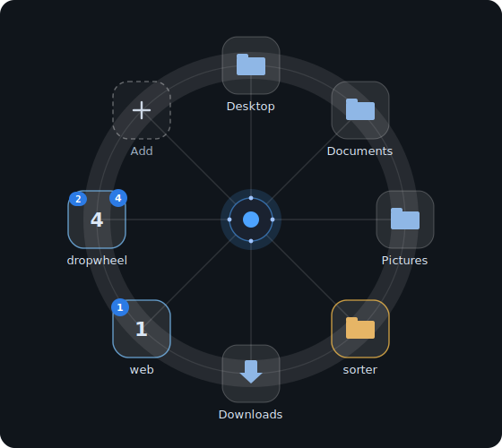

# Dropwheel

  

Overlay launcher for Windows 10/11: a floating orb that expands into a radial
**wheel** of targets (folders and apps). Drop files to copy or move them, drop
**text** from a browser or editor to save it as a file, or route files into
subfolders with **sorter rules**. The wheel opens by itself when a drag
approaches the orb.

## In action

The interface comes to life in an interactive demo, rendered live in your
browser — no video files:

  <a href="https://ivanlarindev.github.io/dropwheel/demo/"><b>▶ Open the live demo</b></a>
  &nbsp;·&nbsp;
  <a href="https://ivanlarindev.github.io/dropwheel/demo/index.en.html">English</a>
  &nbsp;/&nbsp;
  <a href="https://ivanlarindev.github.io/dropwheel/demo/">Русский</a>

It replays the wheel opening, dropping files (copy/move badges), the wheel
auto-opening as a drag approaches the orb, entering a group, and saving dropped
text to a file. The demo source lives in [`docs/demo/`](docs/demo/).

## Install

Dropwheel is a portable app for Windows 10/11 x64 (no installer).

From the [latest release](https://github.com/IvanLarinDev/dropwheel/releases/latest),
download and extract one archive:

- `*-win-x64-self-contained.zip` — recommended; no separate .NET installation
  is required.
- `*-win-x64.zip` — smaller; requires the
  [.NET 10 Desktop Runtime (x64)](https://dotnet.microsoft.com/download/dotnet/10.0).

Run `Dropwheel.exe`. The app is currently unsigned, so Windows SmartScreen may
show a warning. Use the `*-SHA256SUMS.txt` release asset to verify download
integrity.

Config lives in `%AppData%\Dropwheel\config.json`.

## Build from source

    cd src/Dropwheel
    dotnet run

Requires the .NET 10 SDK (Windows). `run.cmd` at the repo root wraps the
common loops: `run.cmd [run|build|publish|stop]`. Run the tests with
`dotnet test` (xUnit, in `tests/Dropwheel.Tests`).

## Controls

| Action                | How                                                |
|-----------------------|----------------------------------------------------|
| Open the wheel        | hover the orb (250 ms), click it, or drag a file near it |
| Drop a file           | drag onto a target tile; the badge names the action — Copy / Move |
| Drop text             | drag selected text onto a folder → saves `text_<date>.txt` (`.md` if it looks like Markdown) |
| Open with an app      | drag files onto an .exe/.bat/.ps1/… target → runs it with them as arguments |
| Force copy / move     | hold Ctrl / Shift while dropping on a target tile   |
| Undo last action      | click “Undo” in the toast — covers file drops, adds, sorts, and deleting a target |
| Edit a target         | right-click its tile                               |
| Add a target          | drop a folder/exe/link onto the “+” tile or the orb |
| Send from Explorer    | enable **Explorer SendTo shortcut** in the tray menu, then use Explorer → Send to → Dropwheel |
| Pin a target from the desktop | Alt+Shift-drag the orb onto a folder, app or file in Explorer or on the desktop — it’s pinned first, next to the hub |
| Create a group        | right-click the orb → “New group…”                 |
| Enter a group         | click its tile, or hover it for 0.5 s while dragging |
| Enter by group code   | hover the orb and type the group's one- or two-digit badge |
| Sort a sorter now     | middle-click a sorter tile                         |
| Reorder tiles         | left-drag a target tile onto another tile; drop on “+” to move it last |
| Move the orb          | Alt + left-drag (any monitor); add Shift to pin instead |
| Wheel at cursor       | Ctrl+Alt+Space (configurable)                      |
| Wheel at the orb      | optional second hotkey — opens the wheel at the orb's home spot without moving the mouse; off until set in Settings |
| Pause sorting         | tray icon → **Pause auto-sort** (watched folders only) or **Pause sorting** (manual sorter drops land unrouted too); both reset on restart |
| Export / reload settings | tray icon → **Export settings…** saves a copy of `config.json`; **Reload settings** re-reads a hand-edited file and applies it live |
| Recent drops          | tray icon → **Recent drops** opens destinations, reveals created files, copies the list as text, or clears the journal |
| Settings              | tray icon or orb context menu                      |

The orb hides automatically in full-screen apps (games, presentations) — while
it's hidden the tray menu shows an *Orb hidden — fullscreen app active* status so
you know where it went — and it can fade out when idle (see Settings).

Turn on **Skip duplicate targets** in Settings and dropping a folder, app or link
that already sits on the current wheel level won't add a second tile — a toast says
it's already there and the existing tile gives a quick pulse so you can spot it. The
same folder can still live on different group levels. Off by default.

Group codes stay attached to their groups when tiles are reordered. If both `1`
and `11` exist, `1` opens after the configurable sequence timeout, while typing
the second `1` before that timeout opens `11` immediately. Right-click a group
to edit or disable its code.

## Feedback, dialogs & broken targets

Every action reports back in the same place: a short toast on the wheel names what
happened in plain words — *Copied*, *Moved*, *Sorted*, *Undone* — with an **Undo**
link where it applies. How long a toast stays up is a setting (1–60 s; error and undo
toasts last twice as long, hovering pauses the timer), and warning/error toasts can
play a short system sound. All the windows (new group, target editor, settings, and a
themed message box) share one frame and one button layout, follow the active theme,
and validate **inline** instead of popping up error dialogs, and settings are grouped
into sections. Hotkeys are picked, not typed: both hotkey fields in Settings are
read-only displays — click one of the suggestion **chips** under a field (Default
`Ctrl+Alt+Space`, `Ctrl+Shift+Space`, `Ctrl+Alt+D`, `Ctrl+Shift+D`, `Ctrl+Alt+F12`)
or press **Record** (it flips to **Stop**) and hit any combination, **Win** modifier
included. The optional second hotkey — *Open at orb* — starts with an **Off** chip
that disables it, and a combination held by the other hotkey shows struck through so
the two can never clash. A live status under each field reads *Available* or *Already
taken by another app*, blocking **Save** until both combos are fine; **Reset**
restores `Ctrl+Alt+Space`. If a target's folder or file goes missing, its tile shows
a small warning mark — not a silent fade — and a click offers **Locate…** or
**Remove**.

Tiles can be personalised in the target editor: an **emoji** replaces the icon as the
tile's face (it keeps its own colours if it has them, or takes the tile colour), and a
**tile colour** swatch paints the tile border — handy for making one target stand out.
Hovering a tile shows its full path in a tooltip, and while a drag hovers a folder
target the status chip's second line reports the free space left on that drive. The
tray menu is grouped by topic with theme-tinted icons; its toggles show an accent
check mark when on.

The tray menu also keeps a short **Recent drops** journal backed by
`%AppData%\Dropwheel\drop-history.json`. Entries open the destination folder, reveal
a single file Dropwheel created (for example saved text), and show full paths in
tooltips. The same menu can copy the whole list as plain text, open the JSON file,
or clear the journal. Next to it live **Export settings…** (saves a dated copy of
`config.json` wherever you point it) and **Reload settings** — re-reads a hand-edited
`config.json` and applies it without a restart; a file with a JSON typo is reported
and the current settings stay untouched, so hand-editing is safe.

When **Explorer SendTo shortcut** is enabled, Dropwheel installs a normal Windows
SendTo shortcut. Selecting files or folders in Explorer and choosing
**Send to → Dropwheel** opens the wheel at the orb's current position; folders and
other target-like items can be added as targets, while ordinary files can be sent to
an existing wheel target without dragging them a second time.

## A living interface

The wheel reacts before you click it. As a drag approaches the orb, a halo glows,
the core breathes and leans toward the cursor, and at the threshold the wheel
unfolds on its own — the inhale flowing straight into the reveal. During an
**Alt+Shift** capture the ghost orb arms as it nears a valid target: its core
fills with the accent colour, a frame lights around the object in Explorer or on
the desktop, and a radar aura pings outward while it holds the lock. On release
the ghost furls back into the orb with a confirming ring, and the wheel opens with
the freshly pinned tile first. Every one of these moments plays live in the
[interactive demo](https://ivanlarindev.github.io/dropwheel/demo/).

While a drag hovers the open wheel, each tile grows a small confidence layer: a
coloured ring, a short chip, and an action badge. The colour reads the intent at a
glance — blue for an informational action, green for a plain copy, amber for a
move, sort or run, and red for a target that can't take the drop. The tile you're
over is emphasised, its label lifted with a one-line status such as *Drop to copy to
Downloads.*, while tiles that can't receive the payload dim back so the valid
choices stand out.

The open wheel is fully keyboard-operable and screen-reader aware. With the wheel
open, **Tab** and the arrow keys move focus between tiles — focus wraps around the
rim and the focused tile shows a *Focus* chip — **Enter** or **Space** activates the
focused tile, and **Escape** closes the wheel. The focused or hovered target is
announced through a live region, so a screen reader reads out where the drop would
land.

The opening animation is configurable in Settings. A style chooser offers **Pop**
(the default), **Radial burst**, **Clock sweep**, and **Magnetic settle**, and a
speed slider scales the reveal from 0.5x to 2.0x.

## Crowded levels (overflow)

A level with only a few targets always draws as the classic single ring. When a
level fills up you can let the surplus flow onto a second, outer ring instead of
cramming everything onto one rim. The layout is chosen in Settings:

- **None** — the classic wheel: every tile stays on one ring, however many there
  are. No second ring ever appears. This is the default, so existing wheels are
  unchanged.
- **Split balanced** — tiles split evenly across two equal-size rings.
- **Overflow band** — the inner ring stays the familiar single wheel up to its
  cap; only the surplus lands on a new outer band, staggered into the gaps.
- **Petals** — tiles alternate between rings, the outer row offset into the gaps
  — the most compact layout.
- **Columns** — tiles form radial pairs on shared spokes (inner + outer per column).

The **threshold** setting is how many real targets a level holds before the
second ring appears, clamped to 4–16. The always-present tiles — the "+" add tile
and, inside a group, "Back" — don't count toward it, so they never push a level
into overflow on their own.

## Interface names

Use these names when describing the wheel in issues, docs, or UI changes. The
[interactive demo](https://ivanlarindev.github.io/dropwheel/demo/) shows the same
parts numbered on a live wheel.

| Name | Meaning |
|------|---------|
| **Orb** | The small floating Dropwheel button that sits on the desktop when the wheel is closed. |
| **Wheel** | The expanded radial overlay that opens around the orb. |
| **Hub** | The center of the open wheel; dropping on it follows the same add-target behavior as dropping on the orb. |
| **Rim** | The outer circular band that target tiles sit around. |
| **Spokes** | The radial guide lines from the hub to each tile. |
| **Target tile** | A square drop destination on the rim, such as Downloads, Documents, Desktop, or Pictures. |
| **Tile label** | The text under a tile, for example `Downloads` or `Pictures`. |
| **Add tile** | The dashed `+` tile used to create a new target in the current level. |
| **Folder target** | A target tile backed by a folder path; dropped files are copied or moved into it. |
| **Run target** | A target tile backed by an executable or script; dropped files are passed to it as arguments. |
| **Sorter target** | A folder target with routing rules, shown with an amber border and a `Sort` badge. |
| **Group target** | A target tile that opens another wheel level instead of receiving files directly. |
| **Badge** | The small marker on a tile that names an action or state in plain words — `Copy`, `Move`, `Sort`, `Run` — plus a group's shortcut number. |

## Sorter targets & routing rules

A **sorter** distributes dropped files into subfolders by rules (amber-bordered
tile, `Sort` badge). Right-click a target and press **Convert to routing rules**, or
start from a **Presets ▾** category (Images, Documents, Archives, …). Rules are
an ordered list edited in a master–detail panel — the first rule whose
conditions all match wins:

- **Extension** — `png jpg webp` (space- or comma-separated, dots optional)
- **Type** — a media kind (image, video, audio, document, archive) instead of spelling out extensions
- **Name contains** / **Name regex** — match against the file name
- **Size (MB)**, **Age (days)** (since last change) and **Created (days ago)** — with `>`, `<`, `≥`, `≤`
- a rule with no conditions is a **catch-all**

Tick **not** on a condition to invert it — the rule then matches everything *except* it, so a
`not` extension `jpg png` even catches files with no extension at all. A whole rule can be switched
off with its **Enabled** checkbox without deleting it: a disabled rule is skipped and shown dimmed
with an `(off)` mark in the list. The **❐** button in a rule's header duplicates it with all its
conditions, for when two rules differ only by destination.

Each rule sends its matches to a subfolder (relative to the target `Path`) or an
absolute folder. The **Test files** box previews which sample files land in the
selected rule. Presets live in `config.json` under `Presets` and are yours to edit.

**Token destinations** — a rule's destination can lift fields out of the file name
with `${name}` placeholders. Add a **Name regex** condition with named groups, e.g.
`(?<ep>ep\d+)_(?<sq>sq\d+)_(?<sh>sh\d+)`, and set the destination to
`episodes\${ep}\${sq}\${sh}`; a file `ep001_sq001_sh001_playblast_v001.mov` then lands
in `episodes\ep001\sq001\sh001\`. Tokens fill from the rule's own Name regex groups, so
one pattern both matches and routes, and the editor shows the tokens a rule can use as clickable
chips right under the destination box — click one to insert it at the cursor. A file that matches
the rule but leaves a token empty goes to the target root rather than into a half-built path.

Besides the name groups there are built-in tokens that need no regex. Drop-time date and
time: `${date}` (ISO `2026-07-13`, so folders sort by date), `${year}`, `${month}`,
`${day}`, `${time}`, `${week}` (ISO week number) and `${quarter}` (`Q1`…`Q4`). Each of these
has two file-date twins that read a date out of the file itself instead of the drop time: an
`f`-prefix for the last-modified date (`${fyear}`, `${fmonth}`…) and a `c`-prefix for the
creation date (`${cyear}`, `${cmonth}`…). And three file-name pieces: `${ext}` (extension),
`${stem}` (name without extension) and `${initial}` (first letter, for A/B/C buckets). Add a
.NET format after a colon on any date token to shape it — `${date:dd-MM-yy}`,
`${date:yyyy-MM}`, `${month:MMMM}`. So `Downloads\${date}` files everything dropped today
into a dated folder, and `Archive\${cyear}\${cmonth}` lays files out by the month they were
created. One more built-in sorts by size: `${size}` drops a file into a coarse bucket —
`tiny`/`small`/`medium`/`large`/`huge` by default, or your own with
`${size: tiny 0.5, small 10, big 100, huge}` (each bucket is a name and its upper bound in MB, the
last one with no number catching the rest). And `${slug}` is the first non-blank line of a file's
text, handy for filing dropped text by its opening line — `notes\${slug}`. The **Presets** menu has a
**Dated folders** section with the date tokens and a **By size** section with the size buckets, ready
to add in one click.

**Files, folders, or both** — each rule has an **Applies to** setting: Files (the default),
Folders, or both. A rule only catches the kinds it is set to, so an existing file rule never
starts grabbing folders on its own — you opt a rule in. Folders carry no extension (so
extension conditions skip them) and report size 0, but their created/modified dates work, so
`${cyear}\${cmonth}` files whole folders by the month they were made. The dated presets are
set to catch both. Two safety rules apply to folders: a folder is never moved into itself,
and a folder that already sits at a location matching the rule's destination shape (for
example a `2026-07-13` folder the sorter itself created) is left in place, so a watched sorter
never re-files its own dated output.

**Watch a folder** — a folder sorter can watch itself. Tick **Watch folder, auto-sort
new files** in the rule editor and Dropwheel routes items that appear in the folder by
the same rules, in the background — files always, and subfolders too when a rule's
**Applies to** includes folders. When watch is enabled, Dropwheel immediately sweeps
existing top-level items once, then keeps watching for new arrivals. It waits for a file
to finish copying before moving it, watches only the top level (items routed into
subfolders don't re-trigger it), and leaves an item in place when no rule matches. A tray
notification reports how many files were sorted. Auto-sort **moves** files and is **not**
tracked by Undo — revert from Explorer if needed. While Watch is on, dropping files onto
the sorter by hand is confirmed first: a **Sort with watched rules?** dialog — warning
that the target also moves future files automatically while Watch is enabled — with a
**Sort** button and **Cancel** appears before the drop is routed. Plain copy or move
drops onto ordinary folders are never gated this way.

The legacy extension map still loads and is migrated to rules on first edit:

    { "Name": "Sort", "Path": "D:\\Sorted",
      "SortRules": { "jpg png webp": "Images", "pdf docx": "Docs", "*": "Other" } }

Undo reverts the whole batch.

## Text drops

Drag selected text from a browser, editor, or chat onto a folder tile and
Dropwheel writes it to `text_YYYY-MM-DD_HH-mm-ss.txt` — or `.md` when the text
looks like Markdown (headings, code fences, links). Dropped on a sorter, the new
file is routed by the rules; Undo removes it.

Settings has a **Saved text file name** template for this: leave it empty for the classic
`text_<date>` name, or use the same `${name}` tokens as sorter destinations — `${slug}` is the first
line of the text, plus `${date}` `${time}` `${year}` `${month}` `${day}`. So `${slug}_${date}` turns
a dragged article heading into `Review of the finale_2026-07-14.md`.

## Run targets (open with)

If a target is an executable or script (`.exe`, `.com`, `.bat`, `.cmd`, `.ps1`,
`.py`, `.pyw`, `.vbs`, `.wsf`, `.js`, `.jar`, or a `.lnk` to one), dropping files
on its tile runs it with the dropped files as arguments — the Windows "open with"
behaviour, shown with a `Run` badge. The launch is confirmed first: dropping files on
a run target opens a themed **Run dropped files?** dialog (*Dropwheel will run &lt;name&gt;
with N item(s) as input.*) with a **Run** button and **Cancel**, and the program only
starts once you confirm. Scripts the shell would only open in an editor
(`.ps1`, `.py`, `.jar`) are launched through their interpreter. PowerShell scripts
run with `-ExecutionPolicy Bypass` (otherwise the drop would open an editor instead
of running), so only add scripts you trust as run targets. This is a launch,
not a file operation, so it isn't undoable.

## Link targets

Drop a link such as `https://example.com`, `tg://resolve?domain=telegram`, or
`https://t.me/c/4379453334/1` onto the orb or the “+” tile to create a
quick-access target. Browser URL drags keep the page title when the drag payload
includes one, and Dropwheel fetches a favicon in the background when the page
exposes a PNG/JPG/ICO/WEBP icon.

Selecting several links in text and dropping that selection on the orb or the “+” tile makes one
tile per distinct link at once, de-duplicated — three lines of URLs become three tiles, not one.

Telegram web links are converted to desktop deep links where possible, so
clicking a `t.me` tile opens Telegram Desktop when the `tg://` protocol is
registered. Dropping files or selected text onto a Telegram tile is confirmed first:
a **Send through Telegram?** dialog (*Dropwheel will copy this payload to the
clipboard, open Telegram, and paste it when Telegram is active.*) with a **Send**
button and **Cancel** appears before anything happens. On confirm, Dropwheel copies
the payload to the clipboard, opens the chat or topic, and pastes it once Telegram is
foreground; review and press Send in Telegram.

## Renaming, conflicts, and the clipboard

A folder target can rename what lands in it. Its **Rename dropped files** template uses the same
`${name}` tokens as sorter destinations — for example `archive-${date}-${stem}` turns `report.pdf` into
`archive-2026-07-14-report.pdf`, keeping the extension. Leave it empty to keep the original names; Undo
covers renamed drops too.

Each target also has an **On name conflict** choice for when a dropped file's name already exists at the
destination: **Ask** (the system Replace/Skip dialog, the default), **Keep both** (adds a number),
**Overwrite** (the replaced file still goes to the Recycle Bin), or **Skip** (leaves the file and reports
how many were skipped).

Turn on **Copy destination path to clipboard after a drop** in Settings and every successful drop puts
its destination on the clipboard — the created file for a single saved file, the destination folder
otherwise — so you can paste the path straight into a chat or an email.

## Themes

Four themes — chosen in Settings. Each carries a full palette: the wheel, the
target editor and settings windows, the orb context menu, and the tray menu all
follow the theme (accent colour, surfaces, text); group and sorter tile borders
are tuned per theme. Switch themes live in the
[demo](https://ivanlarindev.github.io/dropwheel/demo/) to compare Fluent, Dark,
Light and Neon.

## Project layout

    src/Dropwheel/
      Models/    TargetItem, AppConfig, SortRule (conditions), FilePreset
      Services/  storage: TargetStore (JSON config), PresetService, SortMigration;
                 files & drops: FileOps (SHFileOperation), DropDispatch,
                 VirtualFileService, TextDropService, LinkTargetService,
                 TelegramDropService, FileMeta;
                 launching: LaunchService, ShortcutResolver, StartupService;
                 input & presence: MouseHook, KeyboardHook, HotkeyService,
                 OrbGesture, GroupShortcutActivation, GroupShortcutSequence,
                 CursorTargetLocator, ProximityState, FullscreenDetector;
                 sorting & layout: SortService, WheelLayout, WatcherService
                 (auto-sort watched folders), HintPolicy, IconService,
                 LinkMetadataService, ErrorLog;
                 journal & bridge: DropHistoryService (recent drops),
                 ExplorerBridgeService (SendTo shortcut + single-instance pipe)
      UI/        OverlayWindow (hub + rim + spokes wheel, partial classes),
                 DialogShell (shared dialog frame) + DwMessageBox + ToastHost,
                 TargetEditorWindow (+ .Rules master-detail),
                 SettingsWindow (two-pane sections),
                 Themes, Palette (colour roles), MenuTheme.xaml
    tests/       Dropwheel.Tests (xUnit: SortService, SortMigration, FileMeta,
                 TextDropService, WatcherService, HotkeyService, VirtualFileService,
                 LinkTargetService, LinkMetadataService, TelegramDropService)
    docs/demo/   live interactive JS demo (GitHub Pages)

## Known limitations

- Dragging from elevated (admin) processes does not work — Windows UIPI.
- Virtual files (Outlook attachments, browser drags) and dropped text are always
  copied; files auto-renamed on a name clash (the system conflict dialog, or the
  **Keep both** policy) are not tracked by Undo. A target's own **Rename dropped
  files** template is tracked.
- One orb (multi-monitor placement works; one wheel instance).

## Contributing

Contributions are welcome. See [CONTRIBUTING.md](CONTRIBUTING.md) for how to
propose changes, [CODE_OF_CONDUCT.md](CODE_OF_CONDUCT.md) for community
expectations, and [SECURITY.md](SECURITY.md) for reporting vulnerabilities
privately. Bug reports and feature requests use the issue templates.

Note: the per-folder `README.md` files inside `src/` and `docs/demo/` are
written in Russian, the maintainer's working language; code and comments are
English.

## License

[MIT](LICENSE) © Ivan Larin
