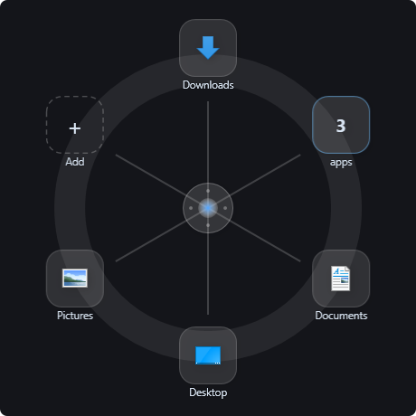
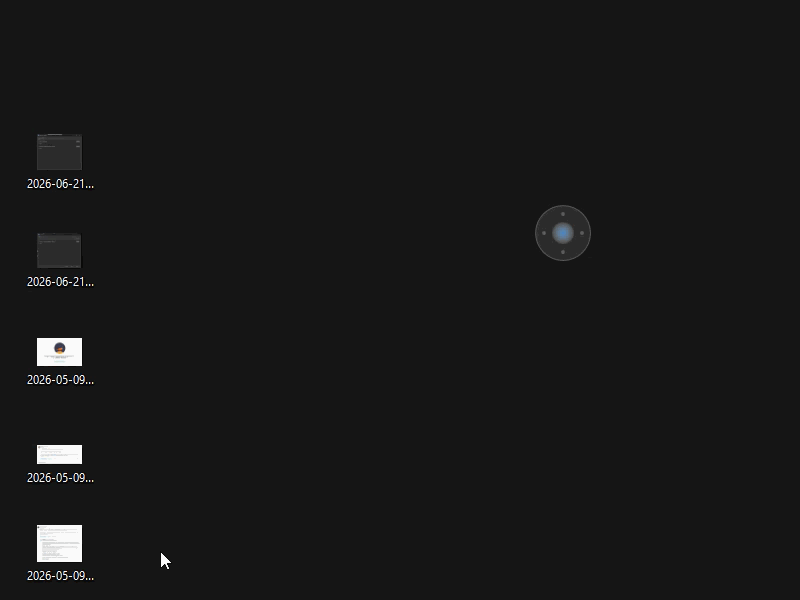
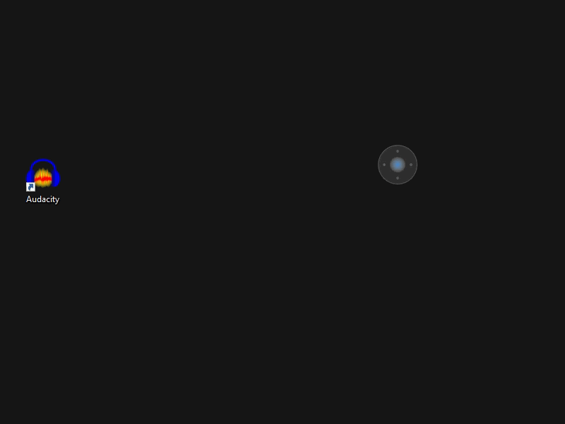
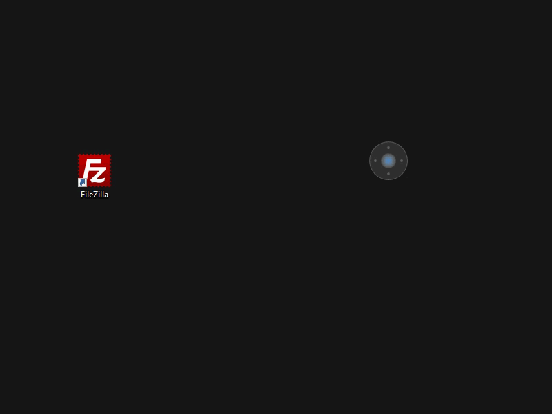
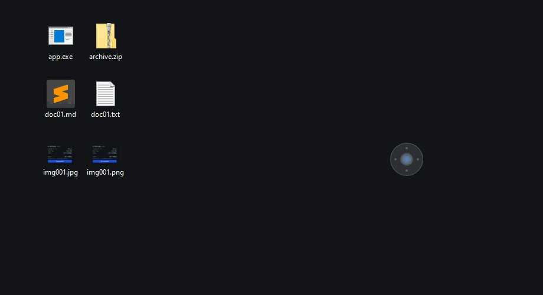
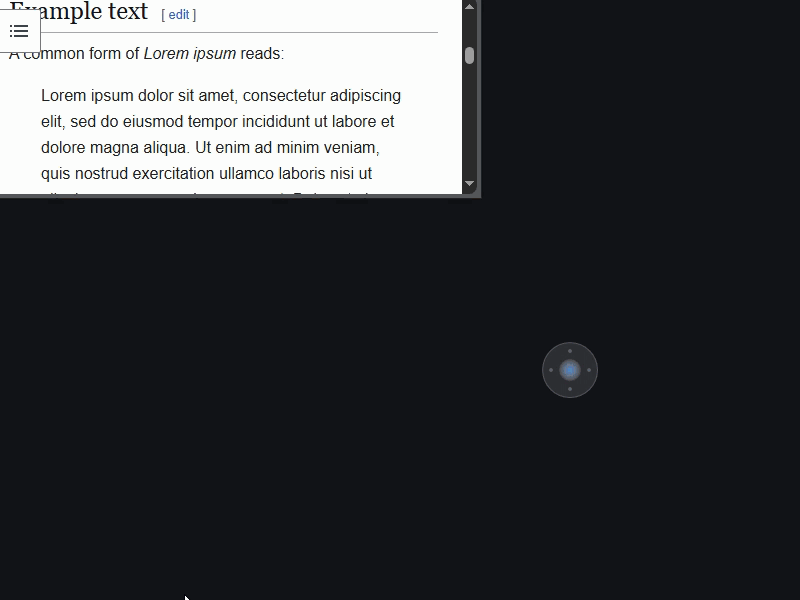
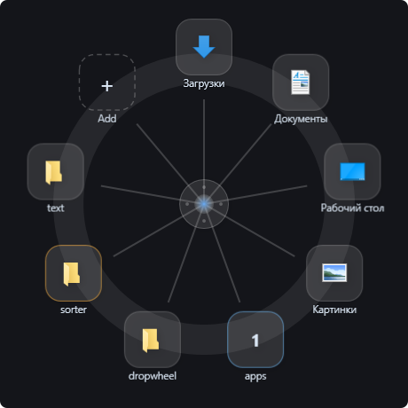
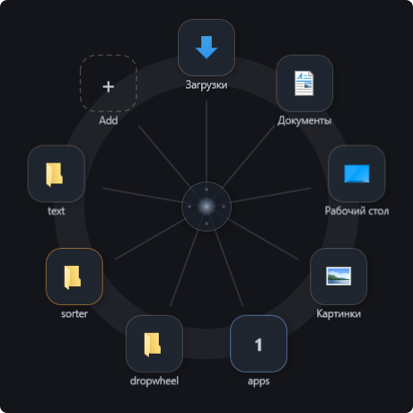
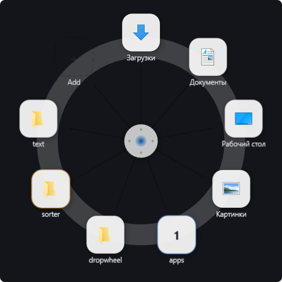
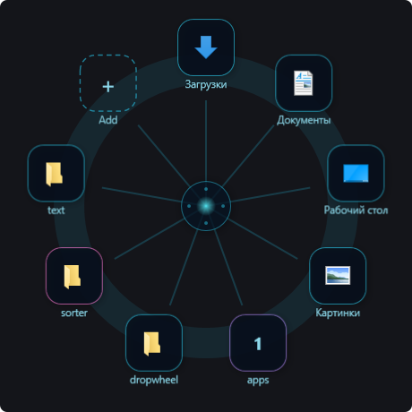

# Dropwheel

  

Overlay launcher for Windows 10/11: a floating orb that expands into a radial
**wheel** of targets (folders and apps). Drop files to copy or move them, drop
**text** from a browser or editor to save it as a file, or route files into
subfolders with **sorter rules**. The wheel opens by itself when a drag
approaches the orb.

## In action

  
  
   
  
  

## Install

Grab the [latest release](https://github.com/IvanLarinDev/dropwheel/releases/latest):

- `Dropwheel-vX.Y.Z-win-x64.zip` — small; requires the .NET 10 Desktop Runtime
- `Dropwheel-vX.Y.Z-win-x64-self-contained.zip` — larger; no runtime needed

Unzip anywhere and run `Dropwheel.exe`. Config lives in `%AppData%\Dropwheel\config.json`.

## Build from source

    cd src/Dropwheel
    dotnet run

Requires the .NET 10 SDK (Windows). `run.cmd` at the repo root wraps the
common loops: `run.cmd [run|build|publish|stop]`. Run the tests with
`dotnet test` (xUnit, in `tests/Dropwheel.Tests`).

## Controls

| Action                | How                                                |
|-----------------------|----------------------------------------------------|
| Open the wheel        | hover the orb (250 ms), click it, or drag a file near it |
| Drop a file           | drag onto a target tile; badge shows ⧉ copy / ➜ move |
| Drop text             | drag selected text onto a folder → saves `text_<date>.txt` (`.md` if it looks like Markdown) |
| Open with an app      | drag files onto an .exe/.bat/.ps1/… target → runs it with them as arguments |
| Force copy / move     | hold Ctrl / Shift while dropping                   |
| Undo last drop        | click “Undo” in the toast (6 s)                    |
| Edit a target         | right-click its tile                               |
| Add a target          | drop a folder/exe onto the “+” tile or the orb     |
| Create a group        | right-click the orb → “New group…”                 |
| Enter a group         | click its tile, or hover it for 0.5 s while dragging |
| Move the orb          | Alt + left-drag (any monitor)                      |
| Wheel at cursor       | Ctrl+Alt+Space (configurable)                      |
| Settings              | tray icon or orb context menu                      |

The orb hides automatically in full-screen apps (games, presentations) and can
fade out when idle (see Settings).

## Sorter targets & routing rules

A **sorter** distributes dropped files into subfolders by rules (amber-bordered
tile, ⇅ badge). Right-click a target and press **Convert to routing rules**, or
start from a **Presets ▾** category (Images, Documents, Archives, …). Rules are
an ordered list edited in a master–detail panel — the first rule whose
conditions all match wins:

- **Extension** — `png jpg webp` (space- or comma-separated, dots optional)
- **Name contains** / **Name regex** — match against the file name
- **Size (MB)** and **Age (days)** — with `>`, `<`, `≥`, `≤`
- a rule with no conditions is a **catch-all**

Each rule sends its matches to a subfolder (relative to the target `Path`) or an
absolute folder. The **Test files** box previews which sample files land in the
selected rule. Presets live in `config.json` under `Presets` and are yours to edit.

The legacy extension map still loads and is migrated to rules on first edit:

    { "Name": "Sort", "Path": "D:\\Sorted",
      "SortRules": { "jpg png webp": "Images", "pdf docx": "Docs", "*": "Other" } }

Undo reverts the whole batch.

## Text drops

  

Drag selected text from a browser, editor, or chat onto a folder tile and
Dropwheel writes it to `text_YYYY-MM-DD_HH-mm-ss.txt` — or `.md` when the text
looks like Markdown (headings, code fences, links). Dropped on a sorter, the new
file is routed by the rules; Undo removes it.

## Run targets (open with)

If a target is an executable or script (`.exe`, `.com`, `.bat`, `.cmd`, `.ps1`,
`.py`, `.pyw`, `.vbs`, `.wsf`, `.js`, `.jar`, or a `.lnk` to one), dropping files
on its tile runs it with the dropped files as arguments — the Windows "open with"
behaviour, shown with a ▶ badge. Scripts the shell would only open in an editor
(`.ps1`, `.py`, `.jar`) are launched through their interpreter. This is a launch,
not a file operation, so it isn't undoable.

## Themes

Four themes — chosen in Settings. Each carries a full palette: the wheel, the
target editor and settings windows, the orb context menu, and the tray menu all
follow the theme (accent colour, surfaces, text); group and sorter tile borders
are tuned per theme.

  
  
   
  
  
   
  Fluent · Dark · Light · Neon

## Project layout

    src/Dropwheel/
      Models/    TargetItem, AppConfig, SortRule (conditions), FilePreset
      Services/  TargetStore (JSON config), FileOps (SHFileOperation),
                 VirtualFileService, TextDropService, SortService, SortMigration,
                 FileMeta, PresetService, ShortcutResolver, MouseHook,
                 HotkeyService, LaunchService, IconService, StartupService,
                 FullscreenDetector
      UI/        OverlayWindow (hub + rim + spokes wheel, partial classes),
                 TargetEditorWindow (+ .Rules master-detail), SettingsWindow,
                 Themes, Palette (per-theme widget colours), MenuTheme.xaml
    tests/       Dropwheel.Tests (xUnit: SortService, SortMigration, FileMeta,
                 TextDropService)
    docs/media/  screenshots and gifs used by this README

## Known limitations

- Dragging from elevated (admin) processes does not work — Windows UIPI.
- Virtual files (Outlook attachments, browser drags) and dropped text are always
  copied; files renamed by the conflict dialog are not tracked by Undo.
- One orb (multi-monitor placement works; one wheel instance).

## Contributing

Contributions are welcome. See [CONTRIBUTING.md](CONTRIBUTING.md) for how to
propose changes, [CODE_OF_CONDUCT.md](CODE_OF_CONDUCT.md) for community
expectations, and [SECURITY.md](SECURITY.md) for reporting vulnerabilities
privately. Bug reports and feature requests use the issue templates.

## License

[MIT](LICENSE) © Ivan Larin
